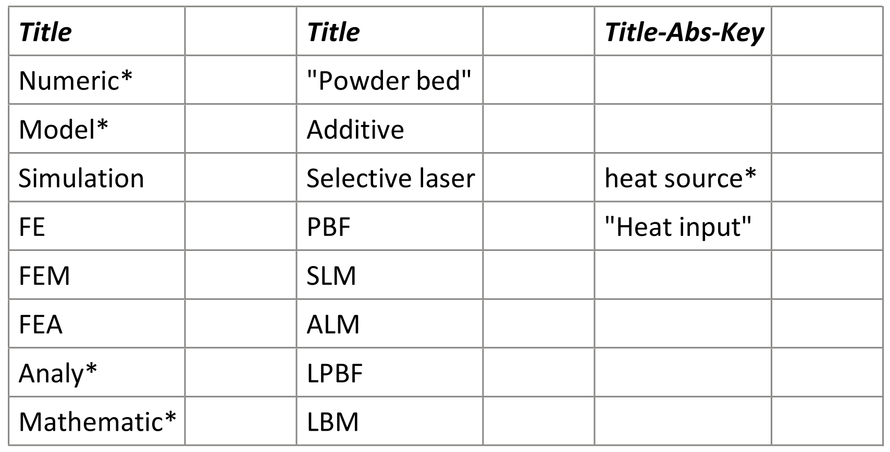

# Introduction

This script is used to generate the text which is to be filled in the search bar in [scopus](https://www.scopus.com/) using their
[advanced searching](https://www.scopus.com/search/form.uri?display=advanced) function.  
Input is a copied table from OneNote, Word or Excel (or other source, but not for sure) of your clipboard.  
Output will be printed in the console, and in your clipboard as well.

## Input
To generate your input, copy your keyword table in your clipboard.  
A keyword table looks like this:  


In a thesaurus search, keywords with similar meanings are grouped together into rows. The keywords within a row are 
connected using the logical operator "or", meaning that any of the keywords in the row may be present in the search results. 
The rows themselves are connected using the logical operator "and", meaning that search results must contain at least 
one keyword from each row to be included in the final results.

In my example, I want to search something about the model of heat source in a physical-mathematical model which simulates
the laser powder bed fusion process. There are many words and phrases with same or similar meaning, so I put the words in
the same row. 

The first line <b> must(!) </b> be a field code which defines your search in [scopus](https://www.scopus.com/). If the first
line is empty, the default field code "TITLE-ABS-KEY" will be used.  
Some example field codes:  
TITLE-ABS-KEY, for searching in title, abstract and keywords.  
TITLE, for searching in title only.  
SRCTITLE, for searching in source title.  

For more informations about the field codes and operators, see: https://www.scopus.com/search/form.uri?display=advanced

As you can see, there is some empty rolls and cells. They would be filtered out while generating the output.

This is my first work and first publication on GitHub, any feedback would be greatly appreciated, (if there is any viewers).

## Output

Example output for given keyword table in the given example:

```
TITLE ( Numeric* OR Model* OR Simulation OR FE OR FEM OR FEA OR Analy* OR Mathematic* ) AND TITLE ( ( Powder AND bed ) OR Additive OR ( Selective AND laser ) OR PBF OR SLM OR ALM OR LPBF OR LBM ) AND TITLE-ABS-KEY ( ( heat AND source* ) OR ( Heat AND input ) ) 
```

## Requirements

Python package pyperclip (https://github.com/asweigart/pyperclip)